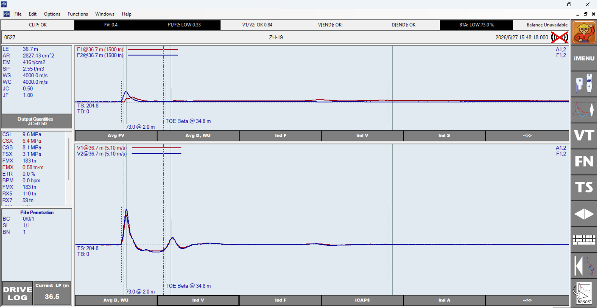
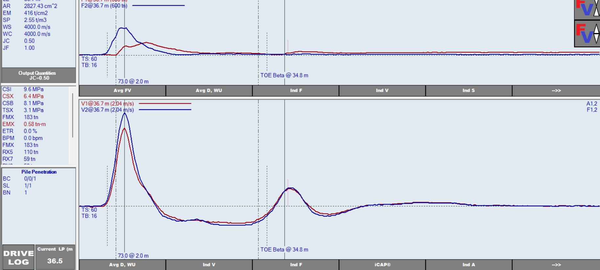

# ZH-19 原始 PDA / CAPWAP 记录

## 来源

- 用户提供的原始文件：`F:/苏州00年闭矿/sar数据/ZH-19.pda`
- 本地副本：[[ZH-19.pda]]
- 本页只记录原始输入和界面观察，不采用任何既有桩的拟合参数或结论。

## 用户提供截图

## 当前固定输入（截图抄录）

| 项目 | 数值 |
| --- | ---: |
| LT / LE | 36.7 m / 36.7 m |
| LP | 36.5 m |
| AR | 2826 cm² |
| EM | 415.786 t/cm² |
| SP | 2.54929 t/m³ |
| WS | 4000 m/s |
| TB | 9 ms |
| DTB | -0.08792 mm |
| T1 / T2 | 14.2 / 21.2 ms |
| T3 / T4 | 21.2 / 25.2 ms |
| TC | 21.2 ms |
| A12 / A34 / AC | 0 / 0.786598 / -0.0178127 g·s |
| CI | 0.628319 m |
| BA | 314.159 cm² |

## 第一轮事实核查：几何输入矛盾

- `AR=2826 cm²` 等效于实心直径约 **600 mm** 的圆截面。
- `CI=0.628319 m` 等效于直径约 **200 mm**。
- `BA=314.159 cm²` 也等效于实心直径约 **200 mm**。

因此，面积、周长和桩端面积并非同一根等效圆桩的几何组合。若实际桩为实心直径约 600 mm，则预期周长约 1.885 m、桩端面积约 2827 cm²；若为 PHC/空心/复合桩，则必须按图纸重新定义净截面、外周长、桩端形式和土塞假设。**在确认实际桩型前，不做材料参数或承载力结论。**

### 用户已修正（2026-07-15）

用户已将 `CI` 改为 **1.88 m**，`BA` 改为 **2827.43 cm²**。该组合与 `AR=2826 cm²` 所对应的约 600 mm 实心圆截面相符，几何输入的内部矛盾已消除。后续分析以此作为几何基线；若设计资料表明为 PHC/空心/复合桩，仍需按实际截面重新核对。

## 第二轮事实核查：数据质量警示

原始 PDA 截图显示 `F1/F2: LOW 0.33`、`BTA: LOW 73.0%` 和 `Balance Unavailable`。它们是需要复核的质量/完整性提示，并不单独等于“桩损坏”或“材料错误”。PDA 手册指出，数据质量异常可来自传感器、传感器安装、线缆、非均匀冲击、桩身不均匀或缺陷；BTA 也可能受波速、长度、接头和噪声影响。

### 单独通道截图复核

- `V1/V2` 在主脉冲、反射和尾段总体重合，且状态栏显示 `V1/V2: OK 0.84`；速度通道暂未见同级一致性警示。
- `F1/F2` 状态仍为 `LOW 0.33`。当前上方力曲线量程为 1500 t，而本击 `FMX` 约 183 t，曲线被压缩，无法仅凭该截图判断两个力通道在何一时段产生主要差异。
- 下一步只做显示放大：将力曲线量程调至约 250 t，并将时间窗缩至冲击开始后的约 30 ms，定位 F1/F2 差异是峰值、反射段、零漂还是全程比例差。

### 60 ms 放大图复核

用户将时间窗缩至 `TS=60 ms`。该窗口足以检查冲击初段及主要反射前后的通道一致性，无需再强制缩至 30 ms。

- F2（蓝）在首个冲击段的峰值更早、更尖；F1（红）较低且更宽，二者并非简单的固定比例差。
- V1/V2 的整体相位和后续反射形态仍较接近；这与状态栏 `V1/V2: OK 0.84` 一致。
- F1/F2 的差异可能涉及传感器安装、标定/通道、线缆或冲击偏心引起的弯曲效应；单一记录无法区分原因。

因此，在排除力通道问题前，平均力曲线不可用于判断波阻抗、波速、材料参数或自动拟合质量；BTA=73% 也不能先解释为桩身缺陷。

## 下一步（未执行自动拟合）

1. 用户确认设计桩型、外径、内径、壁厚、桩端开闭口、是否土塞及传感器以下实际长度。
2. 已以 `AR=2826 cm²、CI=1.88 m、BA=2827.43 cm²` 建立几何基线。
3. 在 PDA 中检查单独 `F1、F2、V1、V2` 曲线，以及传感器序列号、标定系数、安装和线缆情况。
4. 在数据质量确认前，不运行 AC、AF、AT，不以 MQ 反推材料参数。

分析页：[[../../../../../outputs/qa/2026-07-15-ZH-19原始数据基线分析]]。
