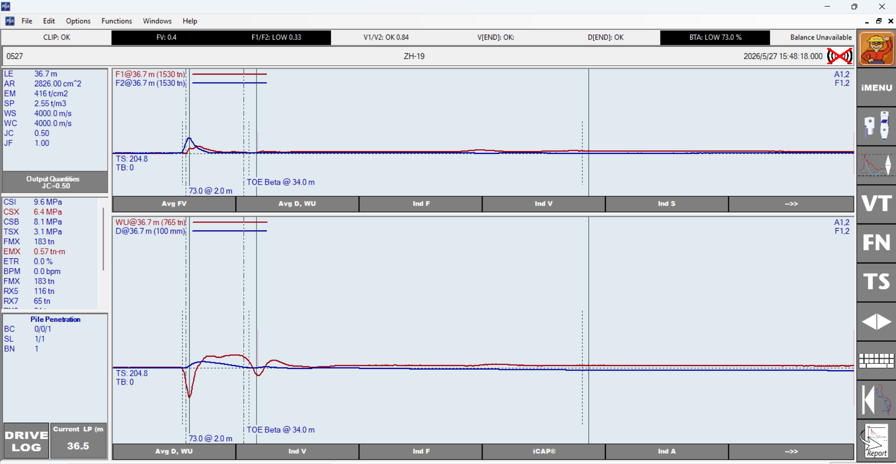
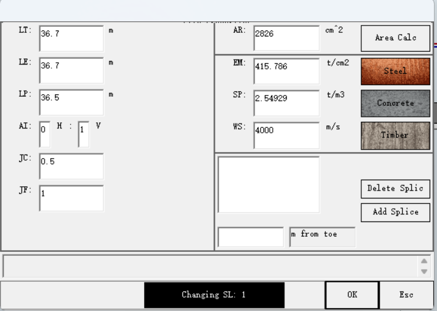
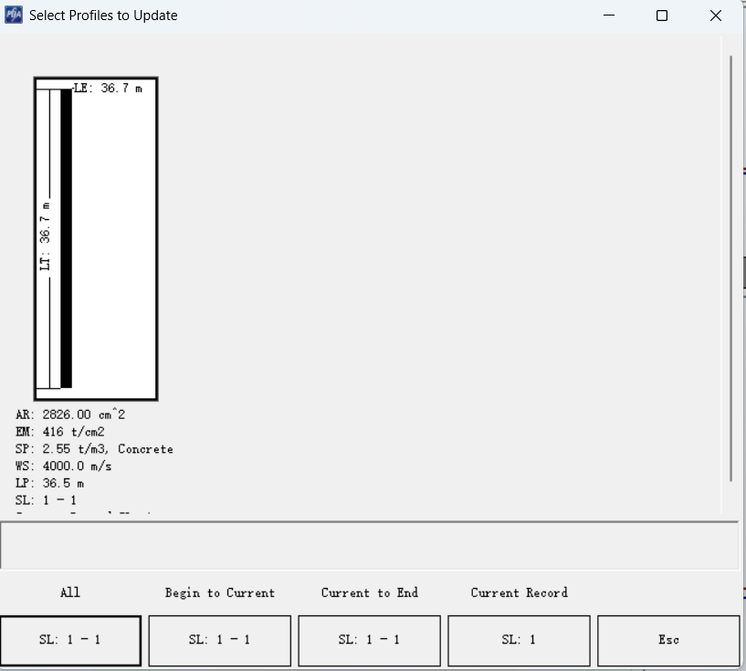
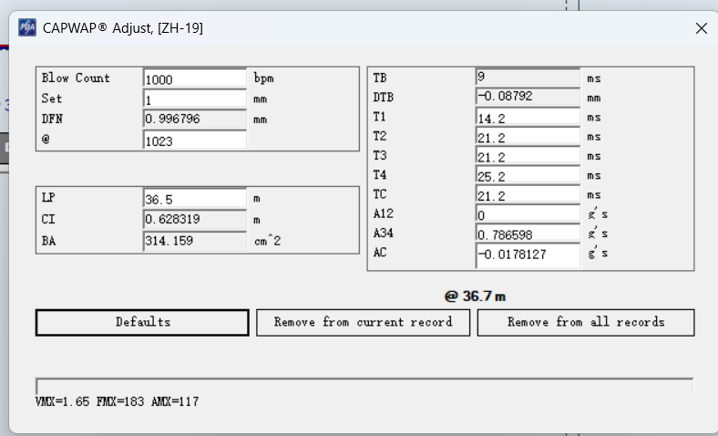

# ZH-19 原始 PDA / CAPWAP 记录

## 来源

- 用户提供的原始文件：`F:/苏州00年闭矿/sar数据/ZH-19.pda`
- 本地副本：[[ZH-19.pda]]
- 本页只记录原始输入和界面观察，不采用任何既有桩的拟合参数或结论。

## 用户提供截图

## 当前固定输入（截图抄录）

| 项目 | 数值 |
| --- | ---: |
| LT / LE | 36.7 m / 36.7 m |
| LP | 36.5 m |
| AR | 2826 cm² |
| EM | 415.786 t/cm² |
| SP | 2.54929 t/m³ |
| WS | 4000 m/s |
| TB | 9 ms |
| DTB | -0.08792 mm |
| T1 / T2 | 14.2 / 21.2 ms |
| T3 / T4 | 21.2 / 25.2 ms |
| TC | 21.2 ms |
| A12 / A34 / AC | 0 / 0.786598 / -0.0178127 g·s |
| CI | 0.628319 m |
| BA | 314.159 cm² |

## 第一轮事实核查：几何输入矛盾

- `AR=2826 cm²` 等效于实心直径约 **600 mm** 的圆截面。
- `CI=0.628319 m` 等效于直径约 **200 mm**。
- `BA=314.159 cm²` 也等效于实心直径约 **200 mm**。

因此，面积、周长和桩端面积并非同一根等效圆桩的几何组合。若实际桩为实心直径约 600 mm，则预期周长约 1.885 m、桩端面积约 2827 cm²；若为 PHC/空心/复合桩，则必须按图纸重新定义净截面、外周长、桩端形式和土塞假设。**在确认实际桩型前，不做材料参数或承载力结论。**

## 第二轮事实核查：数据质量警示

原始 PDA 截图显示 `F1/F2: LOW 0.33`、`BTA: LOW 73.0%` 和 `Balance Unavailable`。它们是需要复核的质量/完整性提示，并不单独等于“桩损坏”或“材料错误”。PDA 手册指出，数据质量异常可来自传感器、传感器安装、线缆、非均匀冲击、桩身不均匀或缺陷；BTA 也可能受波速、长度、接头和噪声影响。

## 下一步（未执行自动拟合）

1. 用户确认设计桩型、外径、内径、壁厚、桩端开闭口、是否土塞及传感器以下实际长度。
2. 以图纸统一 `AR、CI、BA` 后，保存新的基线副本。
3. 在 PDA 中检查单独 `F1、F2、V1、V2` 曲线，以及传感器序列号、标定系数、安装和线缆情况。
4. 在数据质量和几何确认前，不运行 AC、AF、AT，不以 MQ 反推材料参数。

分析页：[[../../../../../outputs/qa/2026-07-15-ZH-19原始数据基线分析]]。
