# ZH-26 原始 PDA / CAPWAP 记录

## 来源

- 用户提供的原始文件：`F:/苏州00年闭矿/sar数据/ZH-26.pda`
- 本地副本：[[ZH-26.pda]]
- 用途：作为与 ZH-19 对比的通道质量对照记录；不是 ZH-19 的替代数据，也不直接复制其单击调整参数。

## 用户提供截图

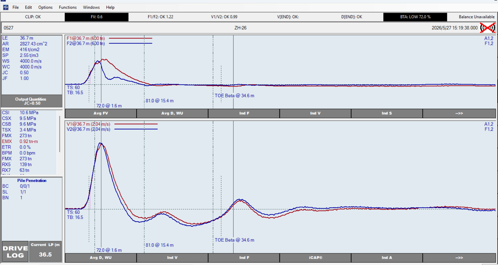

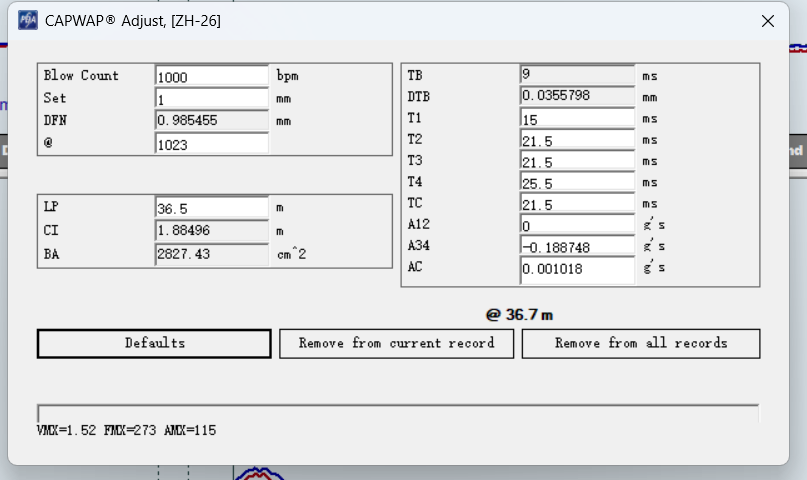

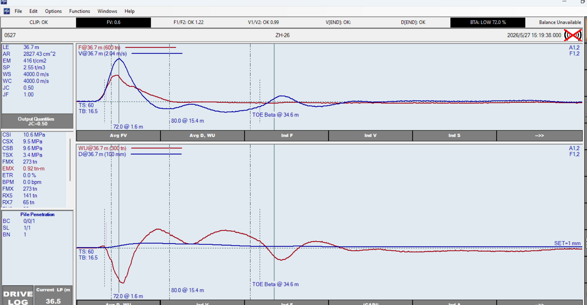

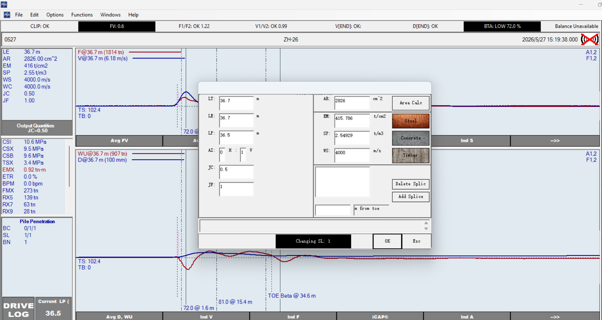

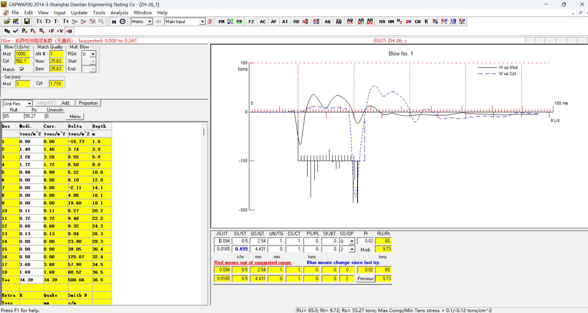

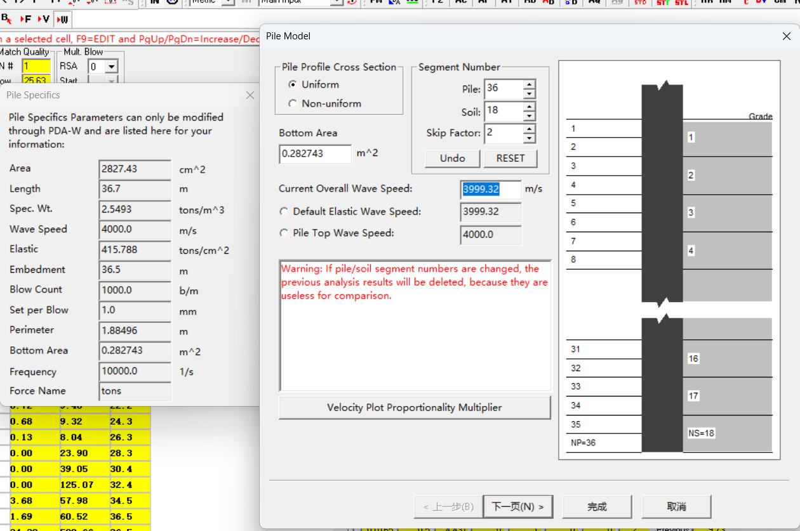

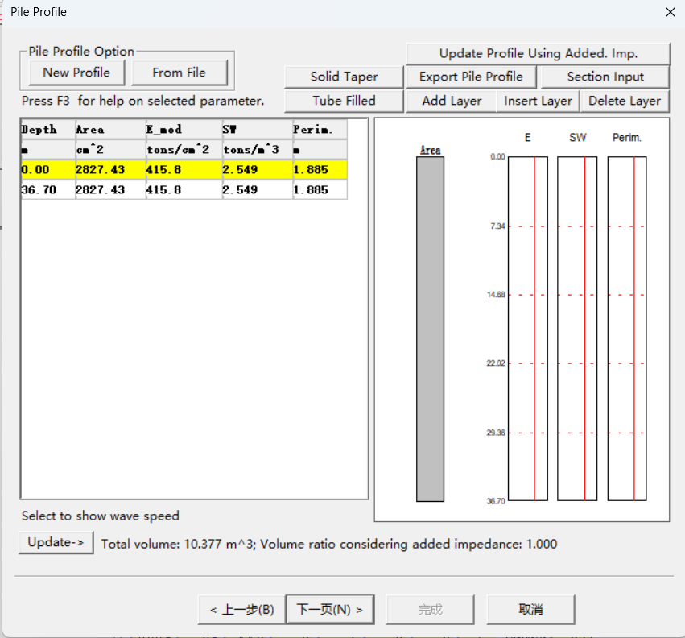

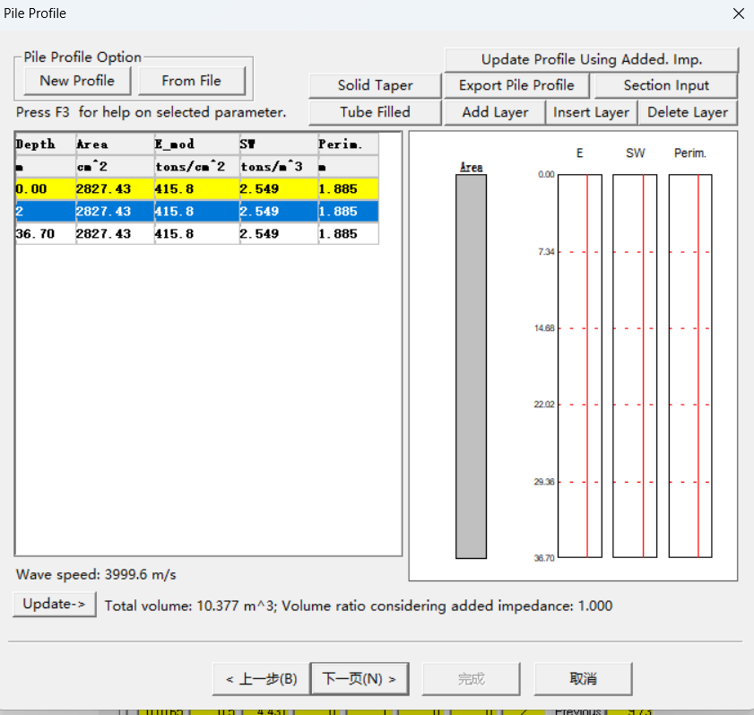

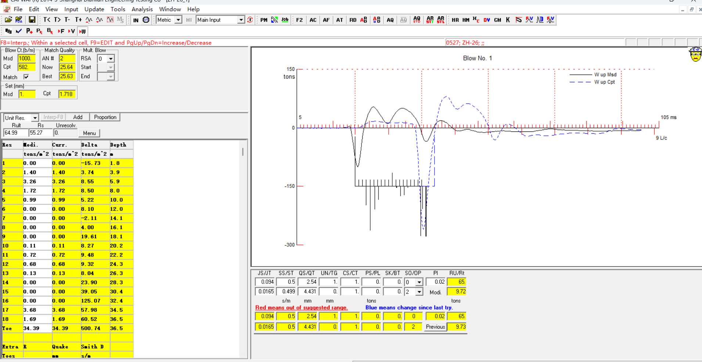

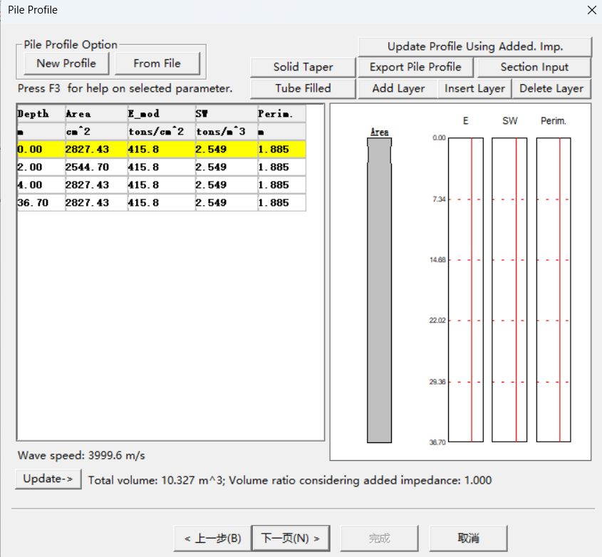

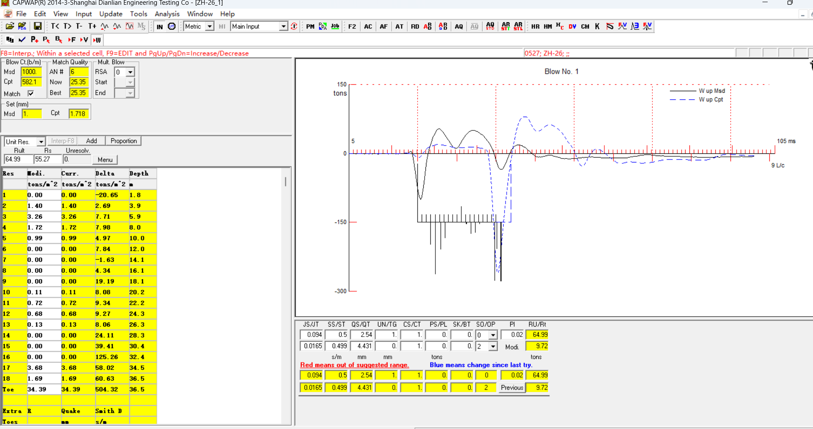

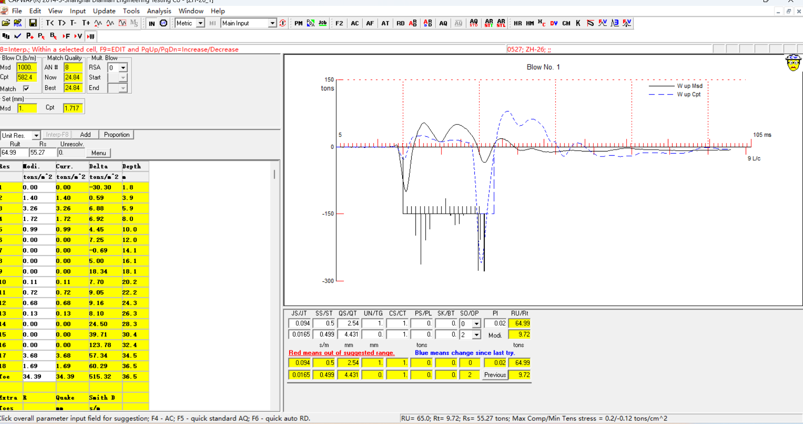

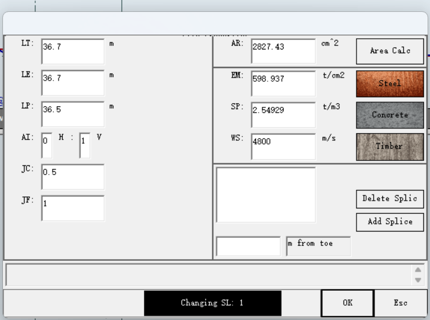

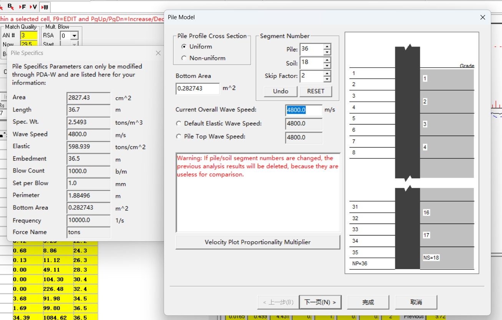

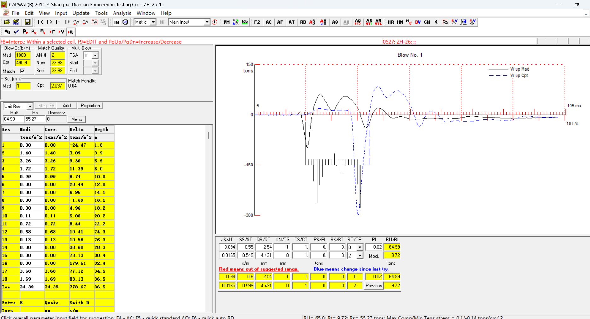

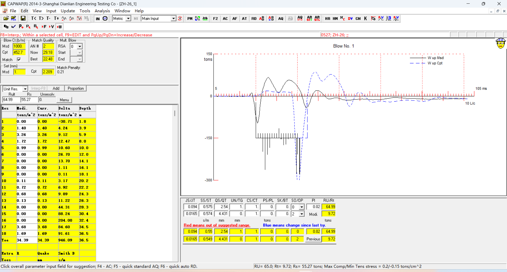

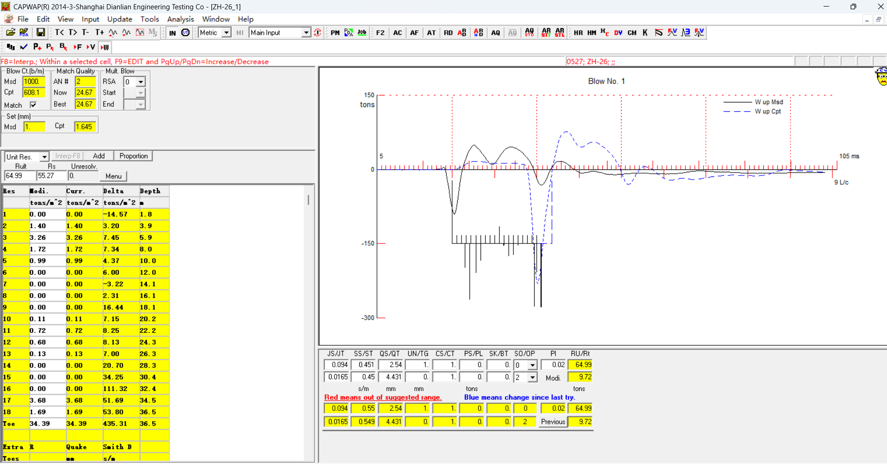

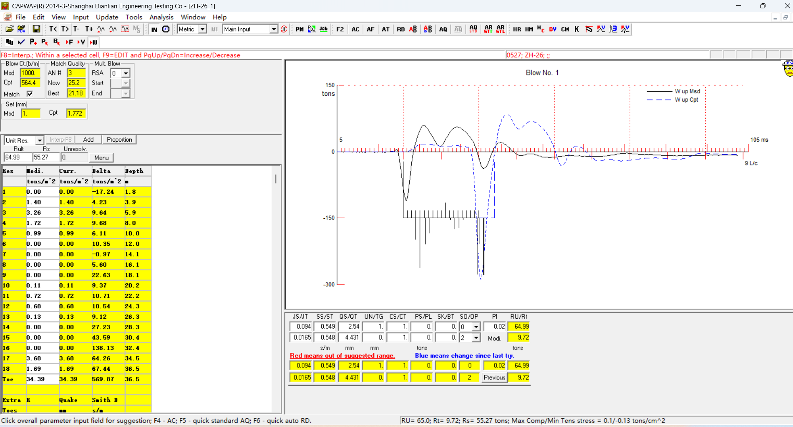

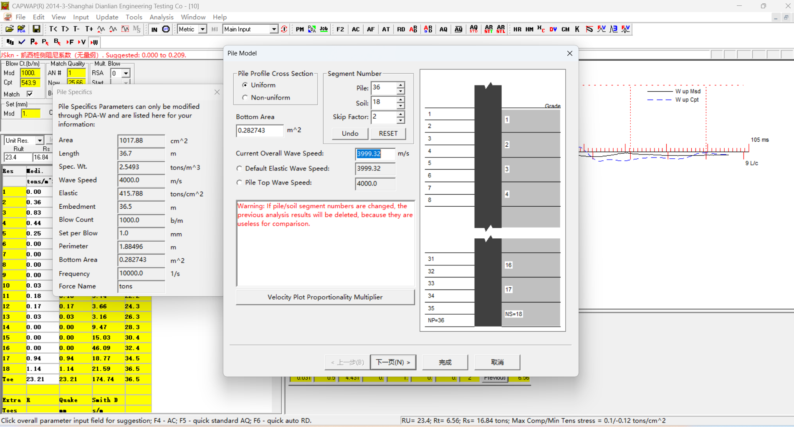

## 当前固定输入与单击调整

| 项目 | 数值 |
| --- | ---: |
| LE / LP | 36.7 m / 36.5 m |
| AR / CI / BA | 2827.43 cm² / 1.88496 m / 2827.43 cm² |
| EM / SP / WS | 416 t/cm² / 2.55 t/m³ / 4000 m/s |
| TB / DTB | 9 ms / 0.0355798 mm |
| T1 / T2 | 15 / 21.5 ms |
| T3 / T4 | 21.5 / 25.5 ms |
| TC | 21.5 ms |
| A12 / A34 / AC | 0 / -0.188748 / 0.001018 g·s |

### PDA 桩身总参数复核

用户补充的 PDA `Pile Specifics` 页显示：`AR=2826 cm²、E=415.786 t/cm²、SP=2.54929 t/m³、WS=4000 m/s`。其中 E、SP、WS 为自洽的混凝土基线；AR 与 CAPWAP Adjust 页的 2827.43 cm²仅为显示取整差异。该页是 PDA 总参数页，不等同于 CAPWAP 的 `Pile Model (PM)` 分段模型页；当前不在此页修改材料参数。

## 通道质量观察

- 状态栏：`F1/F2: OK 1.22`、`V1/V2: OK 0.99`。
- 在 60 ms 放大图中，V1/V2 基本重合；F1/F2 虽仍有冲击形状差异，但被程序判为通过。
- 与 ZH-19 相比，本记录可作为“力/速度通道均通过 PDA 一致性检查”的对照基础。
- 本记录仍显示 `BTA: LOW 72.0%`；这与 ZH-19 的约 73% 接近，不能仅把 BTA 偏低归咎于 ZH-19 的 F1/F2 异常。

## 下一步

切换至 `Avg FV`，保持约 60 ms 时间窗，检查平均力与速度的早期关系；随后再查看 `Avg D, WU` 以独立审查 BTA 所在位置和上行波形。上述步骤均不进行自动拟合。

### 平均 F/V 与 D/WU 截图复核

- 当前输入下的计算桩身阻抗为 `Z=EA/c≈416×2827/4000≈294 t·s/m`；图中 600 t 的力刻度对应 2.04 m/s 的速度刻度，与该阻抗一致。
- 冲击初段的平均力 F（红）与按 Z 换算的速度 V（蓝）并不完全重合；但不能将这直接解释为材料参数错误。
- `BTA=72% @ 1.6 m` 表明传感器下方浅部已存在反射/阻抗变化提示。按 4000 m/s 粗估，其往返到时约 0.8 ms，能够很早影响 F/V 关系；因此没有足够长的无反射纯入射波窗口可由本击单独反推全桩材料参数。
- `80% @ 15.4 m` 与 `TOE Beta @34.6 m` 也应作为需复核的波形特征，而不是先行结论。

ZH-26 仅有这一击记录，无法进行同桩多击重复性核验。因此 1.6 m、15.4 m 和桩端附近的特征均保留为待核验；下一优先级改为寻找同一工程、同桩型且 `F1/F2`、`V1/V2` 均通过的其他桩记录，按各自传感器以下长度和波速对齐后进行跨桩对照。若跨桩重复，才进一步研究真实桩身构造/稳定信号特征；若不重复，优先回查单击冲击和采集条件。

## CAPWAP 均匀模型基线

用户补充的 CAPWAP 截图显示，当前为未进行自动拟合的均匀桩模型基线：

- `MQ=25.63`，计算贯入度 `1.718 mm`，实测设定为 `1 mm`；计算上行波与实测上行波存在明显失配。
- PM：`Uniform`，Pile=36、Soil=18、Skip Factor=2；底面积 `0.282743 m²`。
- Current Overall Wave Speed=`3999.32 m/s`，Default Elastic Wave Speed=`3999.32 m/s`，Pile Top Wave Speed=`4000.0 m/s`；差异仅为离散化显示，波速输入已实际生效。

此基线只说明“均匀混凝土桩 + 当前初始土模型”不能解释记录，不能据此将整桩改为钢材。下一步在单独副本中保持 Pile=36、Soil=18 和总参数不变，仅切换 `Non-uniform` 查看现有 36 段中前两段（约 0–2 m）的可编辑字段，建立局部特征的假设模型；修改前先截图确认字段和默认值。

### 非均匀模型初始页

非均匀模型编辑页当前仍只有两条边界：Depth=0.00 m 与 36.70 m，且 Area=2827.43 cm²、E=415.8 t/cm²、SP=2.549 t/m³、Perimeter=1.885 m 全程相同。因此它等价于均匀混凝土基线。

第一项受控操作仅为使用 `Insert Layer` 增加 Depth=2.00 m 边界，形成 0–2.00 m 与 2.00–36.70 m 两段，并保持两段全部参数相同。运行 F2 后，结果应与均匀模型几乎一致；该检验通过后，才允许将前段作为“局部阻抗假设”的敏感性对照。不得跳过该基线分段检验。

用户已完成插入：表格为 Depth=0.00、2.00、36.70 m，两个区段的 Area=2827.43 cm²、E=415.8 t/cm²、SP=2.549 t/m³、Perimeter=1.885 m 完全一致。此为正确的两段同参基线；接下来只需 `Update ->`、完成向导并 F2 一次，比较 MQ 与波形是否保持不变。

F2 结果：MQ=25.64，而均匀基线为 25.63；计算上行波视觉上无变化。分段基线检验通过。界面确认 Depth=0.00 m 行锁定为传感器处桩顶基准，不能直接编辑；这属于软件设计。BTA 位于约 2 m，局部试验应在 Depth=2.00 m 行以下建立变化。为避免将变化延续到桩端，先插入 Depth=4.00 m 边界，再仅修改 2.00–4.00 m 段的一个参数；其余参数与土模型固定。所有结果均标为敏感性试验，不作为实际桩身结论。

局部低阻抗试验已建成：0–2 m 与 4–36.7 m 保持 Area=2827.43 cm²；2–4 m 段 Area=2544.70 cm²（原值90%），E、SP、周长均保持基线。总模型体积从10.377 m³变为10.327 m³，仅变化约0.5%。待运行 F2，比较 MQ 与上行波。

F2 结果：MQ=25.35，相比两段同参基线 MQ=25.64 仅改善0.29（约1%）；主要峰谷失配仍然存在。结论：2–4 m 局部面积降低10%的假设解释力很弱，不能解释整桩钢材预设曾带来的显著变化。下一步仅作为边界敏感性试验，可将该段面积改为基线72%（约2035.75 cm²），观察与BTA数值量级相当的极端局部低阻抗是否能显著改变早期段；该测试不代表实际截面结论。

72% 边界试验的 F2 结果为 MQ=24.84，较两段同参基线仅改善 0.80（约3.1%），主波形失配仍未消除。即使使用很激进的 2–4 m 局部面积降低，整体拟合改善也有限；因此停止在该局部阻抗特征上继续寻优。此结果仅为模型敏感性排除试验，**不构成实际缩径、空洞或材料改变的判定**。下一步应恢复均匀桩身，在密度保持 `2.54929 t/m³` 的前提下单独改变全桩波速，并按 \(E=\rho c^2\) 同步计算弹性模量。

### 全桩波速单变量对照（有效）

PDA-S 参数页与 CAPWAP PM 页面已核对：`Area=2827.43 cm²`、`SP=2.54929 t/m³`、长度及底面积不变；PM 为 `Uniform`，36 个桩段、18 个土段，整体/默认/桩顶波速均为 `4800 m/s`。弹性模量为 `598.939 t/cm²`，与由原始 `415.786 t/cm²` 按 \((4800/4000)^2\) 推算的约 `598.73 t/cm²` 基本一致，差异来自界面数值精度。

在未启用 AC、AF、AT 自动调整的前提下，F2 的 MQ 由 4000 m/s 均匀基线的 `25.63` 降至 `19.99`（改善约22%）。该结果说明**全桩波速/阻抗相关假设对本记录的拟合有显著影响**；但曲线仍未达到可接受的一致程度，且计算贯入度由约1.718 mm 变为约2.593 mm。因此，4800 m/s 目前只能作为待核验的敏感性候选值，不能据此认定桩材为钢材、也不能单独据此确认实际波速。

后续扫描结果：用户标注第一张为 `4400 m/s`，CAPWAP 当前 MQ=`23.98`、计算贯入度=`2.037 mm`；第二张为 `4600 m/s`，当前 MQ=`29.18`、计算贯入度=`2.209 mm`。第二张界面的 `Best=22.48` 为软件保留的历史最优值，不能替代同一运行的 `Now=29.18` 参与本次比较。由此可见 MQ 对波速并不单调；目前的 4000、4400、4600、4800 m/s 扫描不能用于以“最低 MQ”反算真实波速，后续必须采用独立到时/已知长度或材料资料进行校核。

### 密度（SP）单变量扫描（待参数页复核）

用户标注两次运行均为 `WS=4000 m/s`：`SP=2.30 t/m³` 时 CAPWAP 当前 MQ=`24.67`、计算贯入度=`1.645 mm`；`SP=2.80 t/m³` 时当前 MQ=`25.20`、计算贯入度=`1.772 mm`。与 `SP=2.54929 t/m³` 的均匀基线 MQ=`25.63` 相比，影响幅度为约 1–4%，明显小于 4800 m/s 波速对照的约22%改善。

这两张结果图未显示 PDA-S 参数页，故尚需复核两次运行的 EM 是否按 \(E\propto \rho\) 同步修改、PM 是否仍为均匀模型；在复核前仅记为“按用户说明的 SP 单变量试验”。即便复核通过，结论也只限于：在本次有限范围内，SP 单独变化不是此前钢材预设效果的主要来源。不得将扫描值写成实际材料密度。

### 桩型补充：PHC 中空管桩

用户已明确该桩为 PHC 中空管桩。现有 `Area=2827.43 cm²` 等于外径约600 mm的实心圆面积，因此必须核查是否误将外包络面积用于桩身材料面积。PHC 桩身的材料面积应按 \(A=\pi(D_o^2-D_i^2)/4\) 计算；`Perimeter=1.88496 m` 则对应外周长，需按实际外径核对。桩端是封闭、开口或是否形成土塞尚未知，`Bottom Area` 暂不修改。

在取得外径、壁厚和桩端构造前，停止将当前模型拟合优劣解释为 WS、SP 或桩材问题；此前扫描只保留为“实心截面假设下的敏感性记录”。

用户已建立 PHC 环形截面模型：`Area=1017.88 cm²`、`WS=4000 m/s`、`SP=2.5493 t/m³`、`E=415.788 t/cm²`，PM 仍为 Uniform。该材料面积相对于原实心面积 2827.43 cm² 降低约64%，对应外径约600 mm、内径约480 mm（壁厚约60 mm）的环形截面。截图中的当前 MQ 约为 `25.66`，与原均匀实心面积基线25.63接近，故实际观察到的拟合改善很小。

该结果说明：即使采用了显著不同且更符合 PHC 桩身材料截面的 Area，当前主要失配仍不能仅以“实心/中空面积误用”解释。需要注意截图中的 `Bottom Area=0.282743 m²` 仍为外径600 mm的总面积；对于封闭桩端它可能合理，对于开口桩端或土塞条件则需要单独建模。不得在未确认桩端形式时把 Bottom Area 直接改为环形材料面积。

分析页：[[../../../../../outputs/qa/2026-07-15-ZH-26通道质量对照分析]]。
