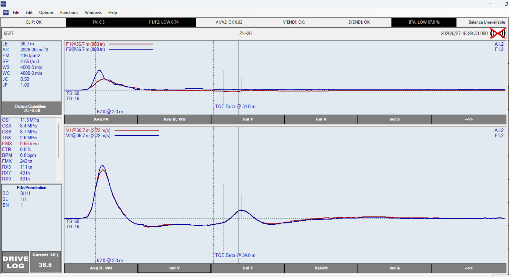
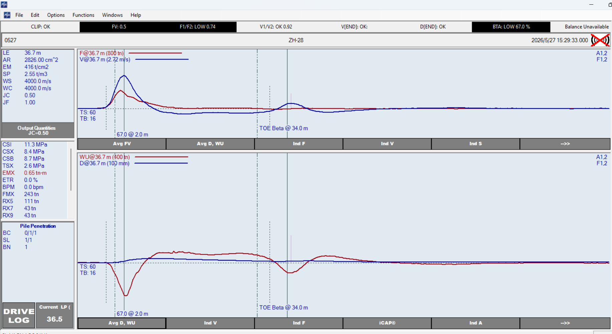

# ZH-28 原始 PDA 记录

## 来源

- 用户提供的原始文件：`F:/苏州00年闭矿/sar数据/ZH-28.pda`
- 本地副本：[[ZH-28.pda]]

## 用户提供截图

## 截图观察

- 桩身主输入显示 `LE=36.7 m、AR=2826 cm²、E=416 t/cm²、SP=2.55 t/m³、WS=4000 m/s、LP=36.5 m`。
- 状态栏：`F1/F2: LOW 0.74`、`V1/V2: OK 0.92`、`BTA: LOW 67.0% @ 2.0 m`。
- `TOE Beta @ 34.0 m`；与 ZH-19、ZH-26 的桩端附近标注处于相近深度。
- 未提供 CAPWAP Adjust 页，`CI` 与 `BA` 是否已按约 600 mm 桩型统一仍待核验。

## 跨桩价值

ZH-28 在约 2.0 m 出现的浅部 BTA 特征，与 ZH-19（约 2.0 m）及 ZH-26（约 1.6 m）相近。它可用于跨桩判断共同早期波形特征，但 F1/F2 未通过，不能作为单独的高质量通道基准。

分析页：[[../../../../../outputs/qa/2026-07-15-跨桩早期波形对照]]。
