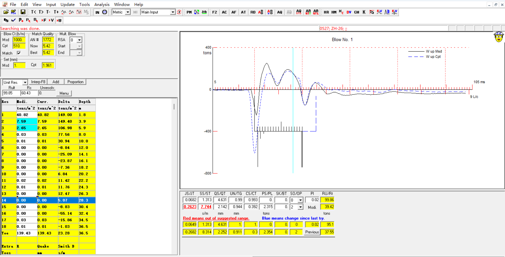
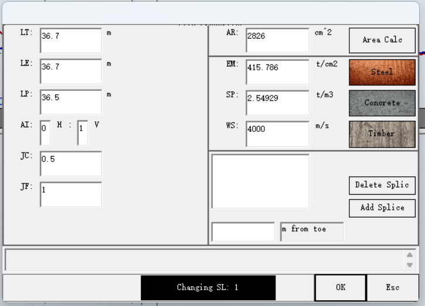
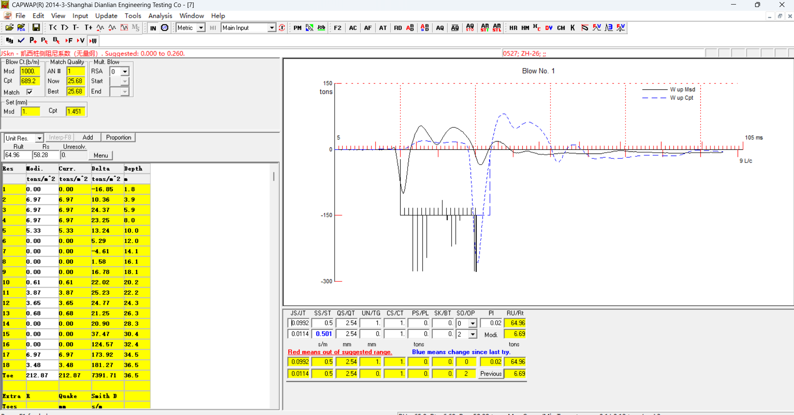
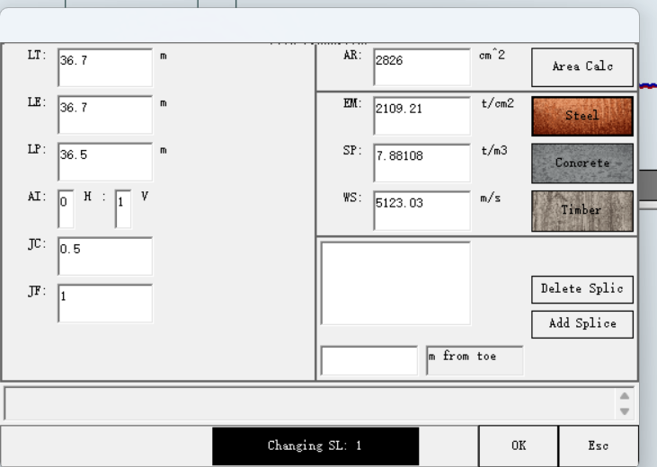
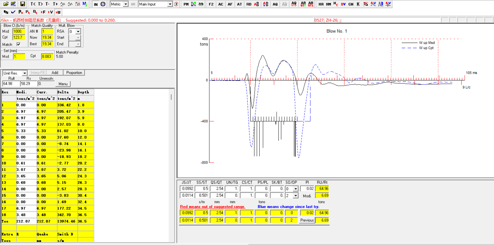

# CAPWAP 预应力混凝土桩参数拟合问题

用户观察：同一条记录在 CAPWAP 中输入钢材参数时拟合较好；按报告所述的预应力混凝土桩参数恢复后，拟合变差。

## 参数对比（用户截图）

| 项目 | 混凝土模型 | 钢材模型 |
| --- | ---: | ---: |
| 传感器以下长度 LT | 36.7 m | 36.7 m |
| 有效长度 LE | 36.7 m | 36.7 m |
| 截面积 AR | 2826 cm² | 2826 cm² |
| 波速 WS | 4000 m/s | 5123.03 m/s |
| 弹性模量 EM | 415.786 t/cm² | 2109.21 t/cm² |
| 密度 SP | 2.54929 t/m³ | 7.88108 t/m³ |
| MQ | 25.68 | 19.34 |
| 计算贯入度 Cpt | 1.451 mm | 8.083 mm |

观察：钢材模型的计算曲线起跳时刻更接近实测，MQ 也降低；但仍存在显著失配，且计算贯入度从 1.451 mm 跳至 8.083 mm。该现象支持“等效波速/阻抗或桩模型需复核”，不能单凭钢模型较优就改变桩材判定。

分析见 [[../../outputs/qa/2026-07-15-CAPWAP预应力混凝土桩参数拟合诊断]]。
