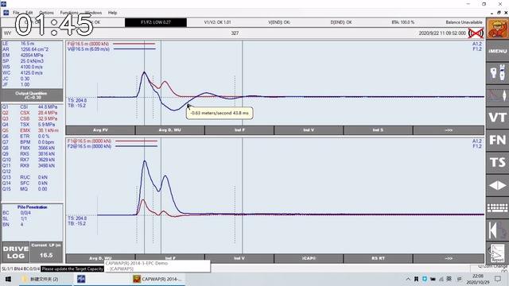
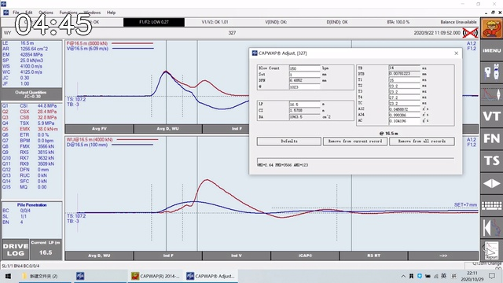
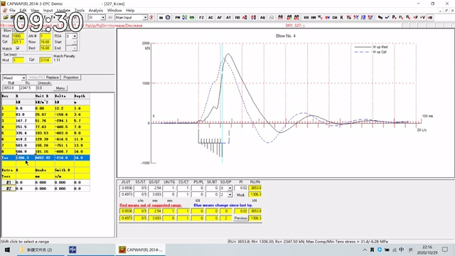
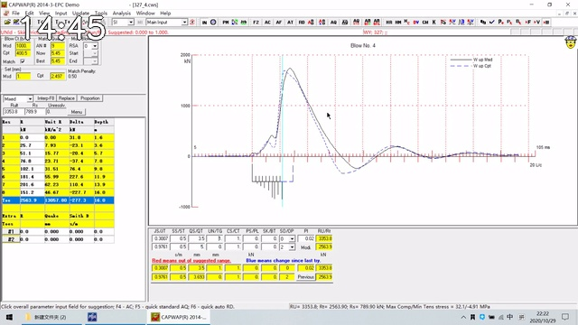
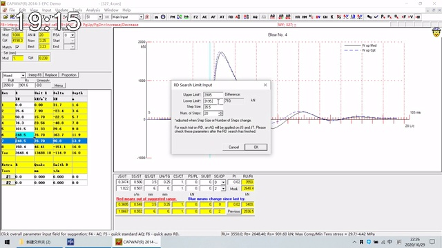

# 高应变信号分析-CAPWAP拟合案例分享

## 来源

- 原始视频：[[../../raw/articles/桩基动测/视频/高应变信号分析-CAPWAP拟合案例分享|本地视频来源页]]
- 在线来源：https://www.bilibili.com/video/BV1qX4y1V7uf/
- 发布者：欧美大地仪器EPC
- 发布时间：2021-03-12
- 时长：23 分 51 秒
- 交叉核对：[[CAPWAP-软件中文操作手册]]

## 一句话摘要

课程以一个实际 CAPWAP 案例演示从初始拟合到人工修正的过程：先检查实测/计算波形，再迭代调整土阻力分布、阻尼、卸载参数与总承载力，并以拟合质量和工程合理性共同判断结果。

## 关键截图

## 时间线与操作要点

| 时间 | 可观察的操作 | 知识点 |
| --- | --- | --- |
| 00:00–01:30 | 打开 CAPWAP 案例并显示计算/实测曲线与土单元表。 | 拟合的对象不是单一峰值，而是整个记录时窗中的波形、相位与幅值关系。 |
| 01:45–04:30 | 切换至力/速度显示，比较实测波与计算波；逐步改变模型。 | 先确认数据调整与桩模型，再解释土参数；基础输入错误会被后续“拟合”掩盖。 |
| 04:45–08:00 | 打开参数调整窗口，显示按深度离散的土单元与曲线。 | 土阻力分布以分段模型表示；每次改动后需重新计算，不能只看某一点。 |
| 08:15–13:30 | 多次选择土单元、改变对应阻力，观察曲线峰谷和反射段的变化。 | 不同深度的阻力会影响不同时间段的上行波；修改应以波形特征、地层与相邻单元连续性共同约束。 |
| 14:30–16:30 | 使用 RD（阻力-阻尼交换）改变承载力，同时尽量保持曲线拟合。 | 可检验总承载力对拟合的敏感性；阻力与阻尼存在可替代性，不能只凭低 MQ 定承载力。 |
| 17:00–20:15 | 继续比较不同阻力/阻尼组合，打开 RD 搜索范围窗口。 | 通过上下限、步长和搜索范围考察可接受的承载力区间，而不是把单次计算值视为唯一真值。 |
| 20:30–23:51 | 回看拟合结果与分段参数，形成最终匹配。 | 最终结果应同时复核阻力分布、阻尼、卸载参数、桩模型和现场锤击信息。 |

## 参数与界面项目

### 桩身与数据输入

| 参数/项目 | 意义 | 使用提醒 |
| --- | --- | --- |
| Area / AR | 桩顶截面积，用于阻抗和力的计算。 | 与桩型和有效截面一致；空心桩是否考虑土塞须明确。 |
| Length / LY | 传感器以下桩长。 | 影响波传播时间与模型长度；与入土深度不是同一概念。 |
| Wave Speed / WS | 应力波速度。 | 与弹性模量、密度共同影响阻抗和相位；修改后应复查约 `2L/c` 之后的曲线。 |
| Elastic Modulus / EM | 桩材弹性模量。 | 可由已知波速、面积和材料信息交叉校核，不宜为追求曲线吻合随意调整。 |
| Spec. Weight | 桩材质量密度/容重。 | 与波速、弹性模量一起构成桩身动力模型。 |
| Embedment / LP | 桩入土深度。 | 决定参与土单元的桩段；过大可能让上部单元出现不具物理意义的小阻力。 |
| Set per Blow / SP | 每击贯入度。 | 用于桩顶位移与锤击数拟合；应使用有代表性的现场值。 |
| Blow Count / BPM | 锤击数。 | 是拟合约束之一；当现场记录不可靠时不应过度追求锤击数拟合。 |
| Circumference | 有效桩周长。 | 用于把总侧阻力换算为单位侧摩阻力。 |
| Bottom Area | 有效桩端面积。 | 用于单位端阻力；开口桩是否计土塞需明确。 |

### 记录调整

| 参数 | 意义 | 使用提醒 |
| --- | --- | --- |
| TB / TE | 分析起始/结束时间。 | 记录应覆盖用于拟合的有效反射段；截断会改变位移、锤击数及后部波形解释。 |
| TC | 第一个速度峰值时刻。 | 是图形标记、桩型图与部分自动计算的参考点。 |
| A12、A34、AC | 不同时段的加速度零线漂移调整量（单位 g）。 | A12 作用于冲击前段，A34 作用于冲击后指定段，AC 从 TC 至记录末端；应在 PDA-W 中复查速度尾部和位移终值。 |
| T1–T4 | A12、A34 各自的作用起止时间。 | 决定零线漂移调整施加在何处，不能脱离原始信号任意设置。 |

### 土模型与拟合控制

| 参数/功能 | 意义 | 使用提醒 |
| --- | --- | --- |
| 土单元阻力 | 各深度段的静阻力/承载力分配。 | 应与地层、桩型和相邻单元连续性相符；局部波形改善不等于分布合理。 |
| Unit Resistance | 单位侧摩阻力或单位端阻力。 | 用于量纲与工程合理性核查，不应出现明显不合理的突变。 |
| SS / ST | 桩侧/桩端 Smith 阻尼相关参数。 | 改变总承载力或分布后需要重新核对；阻尼不合理时，拟合可“好看”但物理解释失真。 |
| CS / CT / UN | 与卸载、再加载或土-桩相对运动有关的参数。 | 影响峰后和后部波形；手册建议先检查 CS，再检查 CT 和 UN，并做灵敏性分析。 |
| RD | Resistance-Damping Exchange，阻力-阻尼交换。 | 在改变静阻力时补偿阻尼以尽量保持拟合，用于承载力敏感性检查，而非直接“优化”出唯一答案。 |
| RD 搜索上下限、步长、步数 | RD 试算的候选承载力范围与离散程度。 | 范围应覆盖工程上合理的值；输出应被视为可接受区间的证据之一。 |
| MQ | 拟合质量指标。 | 没有绝对合格阈值；须同看承载力、分布、阻尼、卸载参数和现场资料。 |

## 课程方法总结

1. **先做数据和桩模型检查。** 先确认记录时窗、零线漂移、每击贯入度、锤击数、截面积、桩长、波速与入土深度。
2. **再以波形的时间位置定位问题。** 依据计算与实测上行波在峰、谷及反射段的差异，判断优先检查哪一段模型。
3. **小步调整、每次复算。** 对土单元阻力、阻尼和卸载参数逐步修改；每次记录改动前后对 MQ、波形和分布的影响。
4. **用 RD 做承载力敏感性检验。** 若不同承载力在调整阻尼后都能有接近的拟合，说明结果不应被解释成单一精确值。
5. **以工程合理性收束。** 选择在地层、桩型、相邻试桩、单位阻力和现场锤击资料上都说得通的解，而不是 MQ 最低的解。

## 局限与待核验

- 本笔记以视频画面、时间抽样和本库 CAPWAP 中文手册交叉整理；未把课程音频逐字转写。未能从画面清晰辨认的专有缩写不强行释义。
- 视频展示的是具体案例操作，不能直接移植为其他桩型、土层或测试记录的参数取值。
- 任何承载力或分段土阻力的最终工程判定，应回到原始 PDA 记录、现行规范、现场资料和具备资质人员复核。

## 关联

- 概念：[[../concepts/CAPWAP拟合流程]]、[[../concepts/桩基动测]]、[[../concepts/桩基检测规范]]
- 相关来源：[[CAPWAP-软件中文操作手册]]、[[高应变动测-唐坚]]、[[欧美大地2024]]、[[JGJ-106-2014-建筑基桩检测技术规范]]

